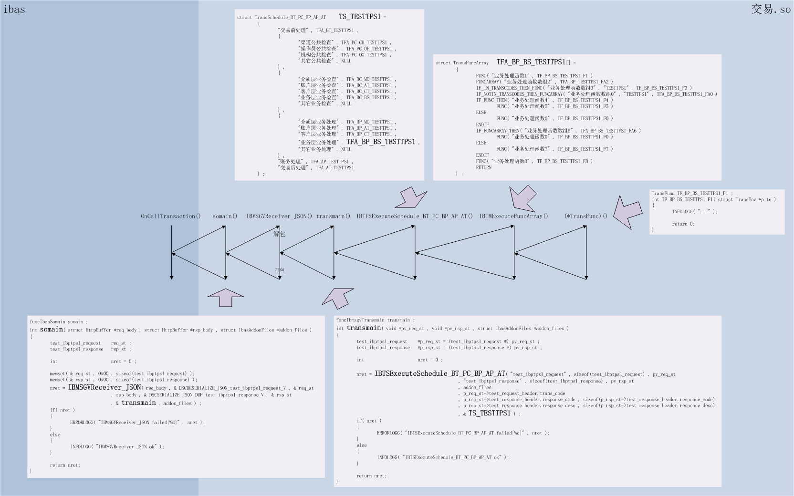

分布式联机服务技术框架(IBP)设计与实战（四、业务逻辑管理框架）
=========================================

| 版本号 | 修订日期 | 修订人 | 内容 |
| --- | --- | --- | --- |
| 0.0.1.0 | 2018-01-27 | 厉华 | 创建 |

<!-- TOC -->

- [1. 报文转换层](#1-报文转换层)
    - [1.1. 接口定义语言](#11-接口定义语言)
    - [1.2. 解包和打包](#12-解包和打包)
- [2. 交易管理公共层](#2-交易管理公共层)
    - [2.1. TM函数树](#21-tm函数树)
    - [2.2. 结构树](#22-结构树)
    - [2.3. 交易处理环境](#23-交易处理环境)
    - [2.4. 动态结构容器](#24-动态结构容器)
- [3. 交易阶段管理层](#3-交易阶段管理层)
    - [3.1. 从`transmain`深挖到TM函数](#31-从transmain深挖到tm函数)
    - [3.2. 预置分阶段模板](#32-预置分阶段模板)

<!-- /TOC -->

# 1. 报文转换层

在IBP通讯服务端，一笔交易的处理要经历很多层：

`通讯服务端平台（进程管理框架->通讯适配器->应用接口层） -somain()-> 应用包（报文转换层->分阶段模板->TM函数树）`

`somain`是应用包入口函数，传入业务请求报文、业务响应报文缓冲区和附带文件名容器。

报文转换层负责把业务请求报文解包成C结构体、调用交易入口函数`transmain`，最后把C结构体打包成业务响应报文。

## 1.1. 接口定义语言

JSON报文解包过程我分为定位和数据提取两步。本人自研开源JSON解析器fasterjson负责定位，它读入JSON流，基于JSON树枝和树叶事件回调应用函数。本人自研开源数据绑定工具DirectStruct负责提取，它读入接口定于语言文件，自动生成fasterjson需要的回调函数，自动、批量、快速提取数据到C结构体。

IBP报文转换基于DirectStruct和fasterjson配合实现JSON报文与C结构体互相快速映射能力。

接口定义语言（IDL）文件用一种中间语法格式表达某一类报文布局以及信息细节，DirectStruct自定义了一套IDL语法，以下是一个示例：

```
STRUCT                  ibms_app_reqmsg # ibms管理协议app配置 请求报文
{
        STRING 32       app
        STRING 256      desc
        STRING 256      bin
        INT 4           timeout
        INT 4           timeout2
        STRING 32       server_node
        INT 4           invalid
}
```

顶层`STRUCT`表示报文定义开始，里面`STRUCT`表示报文内嵌子报文。后面紧跟报文名。

字段定义区第一列是字段类型，第二列是字段实际占用字长，第三列是字段名。DirectStruct支持字段类型有INT 1、INT 2、INT 8、FLOAT 4、FLOAT 8，以及无符号类型如UINT 4，有些类型在不同编译环境有明显不同的类型名，如INT 8。

用'DirectStruct'工具程序`dsc`读入该定义文件，给予参数`-c -c-LOG -c-json`，会输出头文件

```
...
typedef struct
{
        char    app[ 32 + 1 ] ;
        char    desc[ 256 + 1 ] ;
        char    bin[ 256 + 1 ] ;
        int     timeout ;
        int     timeout2 ;
        char    server_node[ 32 + 1 ] ;
        int     invalid ;
} ibms_app_reqmsg ;

_WINDLL_FUNC int DSCINIT_ibms_app_reqmsg( ibms_app_reqmsg *pst );

#include "fasterjson.h"

_WINDLL_FUNC int DSCSERIALIZE_JSON_ibms_app_reqmsg( ibms_app_reqmsg *pst , char *encoding , char *buf , int *p_len );
_WINDLL_FUNC int DSCSERIALIZE_JSON_DUP_ibms_app_reqmsg( ibms_app_reqmsg *pst , char *encoding , char **pp_base , int *p_buf_size , int *p_len );
_WINDLL_FUNC int DSCSERIALIZE_JSON_DUP_ibms_app_reqmsg_V( void *pv , char *encoding , char **pp_base , int *p_buf_size , int *p_len );
_WINDLL_FUNC int DSCDESERIALIZE_JSON_ibms_app_reqmsg( char *encoding , char *buf , int *p_len , ibms_app_reqmsg *pst );
_WINDLL_FUNC int DSCDESERIALIZE_JSON_ibms_app_reqmsg_V( char *encoding , char *buf , int *p_len , void *pv );
...
```

和实现文件

```
...
int DSCSERIALIZE_JSON_ibms_app_reqmsg( ibms_app_reqmsg *pst , char *encoding , char *buf , int *p_len )
{
    ...
}

int DSCSERIALIZE_JSON_DUP_ibms_app_reqmsg( ibms_app_reqmsg *pst , char *encoding , char **pp_base , int *p_buf_size , int *p_len )
{
    ...
}
...
```

应用源码包含头文件，就能用C结构体定义ibms_app_reqmsg定义结构体变量，编译实现文件，与应用链接一起，就能调用头文件中声明的函数，如函数`DSCDESERIALIZE_JSON_ibms_app_reqmsg`用于把报文`ibms_app_reqmsg`解包，数据映射到C结构体`ibms_app_reqmsg`变量中，如函数`DSCSERIALIZE_JSON_DUP_ibms_app_reqmsg`用于把C结构体`ibms_app_reqmsg`变量打包，自分配内存块存放报文`ibms_app_reqmsg`。

以下为一个利用DirectStruct和fasterjson的综合示例：

```
#include "IDL_ibms_app_reqmsg.dsc.h"

ibms_node_reqmsg    ibms_node ;
int                 *p_msg = NULL ;
int                 msg_len = 0 ;

/* 填充结构体 */
DSCINIT_ibms_app_reqmsg( & ibms_node );
strcpy( ibms_node.node , "TEST_NODE" );

/* 打包 */
nret = DSCSERIALIZE_JSON_DUP_ibms_app_reqmsg( & ibms_node , "GB18030" , & p_msg , NULL , & msg_len ) ;
if( nret )
{
    ...
}

/* 解包 */
DSCINIT_ibms_app_reqmsg( & ibms_node );
msg_len = 0 ;
nret = DSCDESERIALIZE_JSON_ibms_app_reqmsg( "GB18030" , p_msg , & msg_len , & ibms_node ) ;
if( nret )
{
    ...
}

free( p_msg );
```

## 1.2. 解包和打包

IBP报文转换层主函数原型如下：

```
/* 解包报文，调用交易处理入口函数，打包报文 */
int IBMSGVReceiver_JSON( struct HttpBuffer *req_buf , DSCDESERIALIZE_JSON_xxx_V *p_unpack_func , void *pv_req_st
                        , struct HttpBuffer *rsp_buf , DSCSERIALIZE_JSON_DUP_xxx_V *p_pack_func , void *pv_rsp_st
                        , funcIbmsgvTransmain *p_transmain_func , struct IbasAddonFiles *addon_files );
```

`req_buf`是业务请求报文，`p_unpack_func`是`DirectStruct`根据接口定义语言文件自动生成的解包函数，`pv_req_st`是解包存放数据的结构体，结构体定义也是由`DirectStruct`根据接口定义语言文件自动生成。

`rsp_buf`是业务响应报文，`p_pack_func`是`DirectStruct`根据接口定义语言文件自动生成的打包函数，`pv_rsp_st`是打包数据来源的结构体，结构体定义也是由`DirectStruct`根据接口定义语言文件自动生成。

`p_transmain_func`是交易入口函数指针，由应用提供。`addon_files`是业务请求附带文件名和响应附带文件名容器，由`somain`直接传进来。

一个稍具现实的示例如下：

`somain.c`

```
#include "ibmsgv_api.h"

#include "IDL_test_ibpts1_request.dsc.h"
#include "IDL_test_ibpts1_response.dsc.h"

funcIbmsgvTransmain transmain ;

funcIbasSomain somain ;
int somain( struct HttpBuffer *req_body , struct HttpBuffer *rsp_body , struct IbasAddonFiles *addon_files )
{
        test_ibpts1_request     req_st ;
        test_ibpts1_response    rsp_st ;

        int                     nret = 0 ;

        INFOLOGG( "ENTER TESTTPS1" );

        memset( & req_st , 0x00 , sizeof(test_ibpts1_request) );
        memset( & rsp_st , 0x00 , sizeof(test_ibpts1_response) );
        nret = IBMSGVReceiver_JSON( req_body , & DSCDESERIALIZE_JSON_test_ibpts1_request_V , & req_st
                                , rsp_body , & DSCSERIALIZE_JSON_DUP_test_ibpts1_response_V , & rsp_st
                                , & transmain , addon_files ) ;
        if( nret )
        {
                ERRORLOGG( "IBMSGVReceiver_JSON failed[%d]" , nret );
        }
        else
        {
                INFOLOGG( "IBMSGVReceiver_JSON ok" );
        }

        INFOLOGG( "LEAVE TESTTPS1" );

        return nret;
}
```

`transmain函数原型`

`int transmain( void *pv_req_st , void *pv_rsp_st , struct IbasAddonFiles *addon_files );`

函数`somain`通过报文转换层函数`IBMSGVReceiver_JSON`调用到函数`transmain`时，请求响应报文已经都变成请求响应结构体了。

# 2. 交易管理公共层

很多分布式联机框架都缺少交易管理框架，IBP交易管理框架脱胎于商业银行核心系统交易管理规范，提供基础应用组件、规范应用开发、用框架约束业务逻辑模块化设计范式、托管数据库事务控制等一揽子解决方案。

IBP交易管理框架分为交易管理公共层和交易阶段管理层两层。

交易管理公共层是交易阶段管理层的公共底层，它提供了TM函数树、结构树、交易处理环境、动态结构等公共组件。交易阶段管理层是根据实施用户具体情况而订制的规范层。

## 2.1. TM函数树

模块化业务开发模式中，TM函数是业务逻辑基本单元，一个TM函数代表着一个可组装的最小业务逻辑单元，比如操作员权限检查、渠道状态检查、登记业务流水、更改登记簿记录状态、账务记账等。这需要业务开发人员在前期设计时充分分解和解耦可复用逻辑边界。

TM函数原型如下：

`int TransFunc( struct TransEnv *p_te );`

`p_te`是交易处理环境，所有交易管理框架中所需公共信息都包含在这个结构体中。

TM函数配置组装越来越大，直至汇聚成一棵树。

IBP的TM函数树机制的核心是TM函数数组结构体：

```
struct TransFuncArray
{
        int                     type ; /* 本单元下挂的类型 */

        char                    *desc ; /* 中文描述，便于流程描述 */
        struct TransFuncArray   *func_array ; /* 下挂的是函数数组 */
        TransFunc               *func ; /* 下挂的是函数 */
        char                    *func_para ; /* 函数参数 */

        char                    *trans_codes ; /* 交易码列表，用于交易码分支 */
} ;
```

通过这个结构体定义和语法糖宏，业务逻辑组装人员可以很直观方便的用已有TM函数和新开发TM函数配置出一棵树。比如：

```
struct TransFuncArray   TFA_BP_BS_TESTTPS1[] =
        {
                FUNC( "业务处理函数1" , TF_BP_BS_TESTTPS1_F1 )
                FUNCARRAY( "业务处理函数数组2" , TFA_BP_TESTTPS1_FA2 )
                IF_IN_TRANSCODES_THEN_FUNC( "业务处理函数数组3" , "TESTTPS1" , TF_BP_BS_TESTTPS1_F3 )
                IF_NOTIN_TRANSCODES_THEN_FUNCARRAY( "业务处理函数数组0" , "TESTTPS1" , TFA_BP_BS_TESTTPS1_FA0 )
                IF_FUNC_THEN( "业务处理函数4" , TF_BP_BS_TESTTPS1_F4 )
                        FUNC( "业务处理函数5" , TF_BP_BS_TESTTPS1_F5 )
                ELSE
                        FUNC( "业务处理函数0" , TF_BP_BS_TESTTPS1_F0 )
                ENDIF
                IF_FUNCARRAY_THEN( "业务处理函数数组6" , TFA_BP_BS_TESTTPS1_FA6 )
                        FUNC( "业务处理函数0" , TF_BP_BS_TESTTPS1_F0 )
                ELSE
                        FUNC( "业务处理函数7" , TF_BP_BS_TESTTPS1_F7 )
                ENDIF
                FUNC( "业务处理函数8" , TF_BP_BS_TESTTPS1_F8 )
                RETURN
        } ;
```

语法糖宏完整列表如下：

| TM函数配置语法糖宏 | 说明 |
| --- | --- |
| FUNCARRAY(_desc_,_funcarray_) | 执行子TM函数树 |
| FUNC(_desc_,_func_) | 执行TM函数 |
| FUNC_PARA(_desc_,_func_,_para_) | 执行带参数的TM函数 |
| IF_IN_TRANSCODES_THEN_FUNCARRAY(_desc_,_transcode_,_funcarray_) | 如果当前交易码在配置交易码列表中，则递归执行子TM函数树 |
| IF_IN_TRANSCODES_THEN_FUNC(_desc_,_transcode_,_func_) | 如果当前交易码在配置交易码列表中，执行TM函数 |
| IF_IN_TRANSCODES_THEN_FUNC_PARA(_desc_,_transcode_,_func_,_para_) | 如果当前交易码在配置交易码列表中，执行带参数的TM函数 |
| IF_NOTIN_TRANSCODES_THEN_FUNCARRAY(_desc_,_transcode_,_funcarray_) | 如果当前交易码不在配置交易码列表中，则递归执行子TM函数树 |
| IF_NOTIN_TRANSCODES_THEN_FUNC(_desc_,_transcode_,_func_) | 如果当前交易码不在配置交易码列表中，执行TM函数 |
| IF_NOTIN_TRANSCODES_THEN_FUNC_PARA(_desc_,_transcode_,_func_,_para_) | 如果当前交易码不在配置交易码列表中，执行带参数的TM函数 |
| IF_FUNCARRAY_THEN(_desc_,_funcarray_) | 递归执行子TM函数树，如果有报错，执行里层配置 |
| IF_FUNC_THEN(_desc_,_func_) | 执行TM函数，如果有报错，执行里层配置 |
| IF_FUNC_PARA_THEN(_desc_,_func_,_para_) | 执行带参数的TM函数，如果有报错，执行里层配置 |
| ELSE | IF条件为假时，执行里层配置 |
| ENDIF | 结束IF语句块 |
| RETURN | 结束配置块 |

交易管理公共层提供了TM函数树执行引擎函数用于根据语法糖宏背后的流程控制逻辑执行TM函数树。

`int IBTMExecuteFuncArray( struct TransEnv *p_te , char *desc , struct TransFuncArray *p_tfa );`

一般业务开发人员不能直接调用该引擎函数，TM函数树与交易之间还有分阶段模板，业务开发人员调用分阶段模板引擎函数，分阶段模板引擎函数控制执行交易内不同阶段逻辑和数据库事务控制。

## 2.2. 结构树

结构树用于在不同TM函数之间传递数据，数据包在结构体里，每个结构体有一个名字（字符串），结构体挂成一颗树，叫做结构树。

交易管理公共层提供了结构树函数集用于挂结构、取结构。

```
int IBTMAppendStructBlock( struct TransEnv *tpe , char *name , long struct_size , void **ppmem );
int IBTMGetStructBlock( struct TransEnv *tpe , char *name , long struct_size , void **ppmem );
int IBTMAppendGetStructBlock( struct TransEnv *tpe , char *name , long struct_size , void **ppmem );
```

参数`struct_size`是为了防止源码未完整重编译造成的结构体定义版本不一致。

## 2.3. 交易处理环境

交易处理环境包含了交易处理过程中所有公共信息，如结构树根节点，统一包成一个结构体，也是TM函数原型中的唯一统一参数。

创建环境函数会要求应用把交易码、响应码、响应描述等字段地址传给它并保存起来，后续TM函数的处理中就可以用统一的框架函数读写这些信息，如不同报文的响应码字段可能路径不一致，创建环境函数记录下响应码字段地址，框架函数IBTMFormatResponseInfo就能在任意交易中统一设置响应码。

交易处理环境结构定义如下：

```
struct TransEnv
{
        struct rb_root          structs_rbtree ; /* 结构数据块树 */
        struct IbasAddonFiles   *addon_files ; /* ibas请求文件和响应文件信息 */
        char                    trans_code[ IBP_MAXLEN_APP + 1 ] ; /* 业务交易码 */
        char                    *func_para ; /* 函数配置参数 */

        int                     execute_depth ; /* 流程深度 */

        char                    *response_code ; /* 交易结果缓冲区 */
        int                     response_code_bufsize ; /* 交易结果缓冲区大小 */
        char                    *response_desc ; /* 交易结果描述缓冲区 */
        int                     response_desc_bufsize ; /* 交易结果描述缓冲区大小 */

        int                     database_transation_depth ; /* 数据库事务深度 */
} ;
```

以后根据需要可以补充字段。

该结构体对应用层不可直接访问字段，必须通过框架函数访问，以保持内部版本一致。

## 2.4. 动态结构容器

当项目规模越来越大，模块越来越多，开发团队越来越细分，不可避免要做模块化和模块解耦，系统内模块间接口版本管理显得越来越重要，一种架构层面解决方案是采用微服务，但微服务单个实例中还是存在多模块交互问题。

之前的C栈项目实践中发现，模块间函数调用业务字段都包装在单个结构体内，当底层模块使用结构定义改变后如果上层涉及模块没有及时全编译可能运行时会造成地址crash，要解决这个问题首先得让程序能主动发现和防御，IBP设计了动态结构容器来实现运行时应用主动发现，而不是被动crash。

动态结构容器原理非常简单，调用方根据接口定义，构建动态结构容器（树），把字段都压入容器（挂接树上），然后调用被调用方，被调用方从容器中把字段都弹出来（从树上卸下来）并做安全检查，如果发现不符合接口规格的立即返回接口不一致错误，树的构建是运行时操作的，这样就能运行时主动防御接口变动而有部分代码未全编译的问题。

动态结构容器实现的难点是如何尽量简化应用开发人员的使用心智负担，IBP使用可变参数宏封装简化了底层复杂性。

示例见本系列《六、开发接口参考》。

# 3. 交易阶段管理层

## 3.1. 从`transmain`深挖到TM函数



一笔交易在框架管理中经历的层次如下：

`transmain->分阶段模板->TM函数树->TM函数`

函数`transmain`调用分阶段模板引擎。

```
funcIbmsgvTransmain transmain ;
int transmain( void *pv_req_st , void *pv_rsp_st , struct IbasAddonFiles *addon_files )
{
        test_ibpts1_request     *p_req_st = (test_ibpts1_request *) pv_req_st ;
        test_ibpts1_response    *p_rsp_st = (test_ibpts1_response *) pv_rsp_st ;

        int                     nret = 0 ;

        nret = IBTSExecuteSchedule_BT_PC_BP_AP_AT( "test_ibpts1_request" , sizeof(test_ibpts1_request) , pv_req_st
                                                , "test_ibpts1_response" , sizeof(test_ibpts1_response) , pv_rsp_st
                                                , addon_files
                                                , p_req_st->test_request_header.trans_code
                                                , p_rsp_st->test_response_header.response_code , sizeof(p_rsp_st->test_response_header.response_code)
                                                , p_rsp_st->test_response_header.response_desc , sizeof(p_rsp_st->test_response_header.response_desc)
                                                , NULL , NULL , & TS_TESTTPS1 ) ;
        if( nret )
        {
                ERRORLOGG( "IBTSExecuteSchedule_BT_PC_BP_AP_AT failed[%d]" , nret );
        }
        else
        {
                INFOLOGG( "IBTSExecuteSchedule_BT_PC_BP_AP_AT ok" );
        }

        return nret;
}
```

分阶段模板引擎调用TM函数树执行引擎分别执行分阶段配置，并以阶段为单位控制数据库事务。

```
int IBTSExecuteSchedule_BT_PC_BP_AP_AT( char *req_msg_name , int sizeof_req_msg , void *p_req_st
                                        , char *rsp_msg_name , int sizeof_rsp_msg , void *p_rsp_st
                                        , struct IbasAddonFiles *addon_files
                                        , char *trans_code
                                        , char *response_code , int response_code_bufsize
                                        , char *response_desc , int response_desc_bufsize
                                        , struct TransFuncArray  *TF_PC_BF_ResgisterTransTblA1
                                        , struct TransFuncArray  *TF_BC_BF_UpdateTransTblB1
                                        , struct TransSchedule_BT_PC_BP_AP_AT *p_ts )
{
        struct TransEnv         *p_te = NULL ;

        int                     nret = 0 ;

        /* 创建交易处理环境 */
        p_te = IBTMCreateTransEnv( req_msg_name , sizeof_req_msg , p_req_st
                                        , rsp_msg_name , sizeof_rsp_msg , p_rsp_st
                                        , addon_files
                                        , trans_code
                                        , response_code , response_code_bufsize
                                        , response_desc , response_desc_bufsize ) ;
        if( p_te == NULL )
        {
                ERRORLOGG( "CreateTransEnv failed , errno[%d]" , errno );
                return IBP_IBTM_ERROR_ALLOC;
        }

        /* 执行计划 */
        nret = IBTSRecursiveSchedule_BT_PC_BP_AP_AT( p_te , TF_PC_BF_ResgisterTransTblA1 , TF_BC_BF_UpdateTransTblB1 , p_ts ) ;
        if( nret )
        {
                ERRORLOGSG( "IBTSRecursiveSchedule_BT_PC_BP_AP_AT failed[%d]" , nret );
                IBTMFormatResponseInfo( p_te , 999999 , "交易失败" );
        }
        else
        {
                INFOLOGSG( "IBTSRecursiveSchedule_BT_PC_BP_AP_AT ok" );
                IBTMFormatResponseInfo( p_te , 0 , "交易成功" );

        }

        /* 销毁交易处理环境 */
        IBTMDestroyTransEnv( p_te );

        return 0;
}

int IBTSRecursiveSchedule_BT_PC_BP_AP_AT( struct TransEnv *p_te , struct TransFuncArray  *TF_PC_BF_ResgisterTransTblA1
                                        , struct TransFuncArray  *TF_BC_BF_UpdateTransTblB1
                                        , struct TransSchedule_BT_PC_BP_AP_AT *p_ts )
{
        int             nret = 0 ;

        if( TF_PC_BF_ResgisterTransTblA1 == NULL )
        {
                ERRORLOGG( "TF_PC_BF_ResgisterTransTblA1 IS NOT NULL" );
                return IBP_IBTS_ERROR_PARAMETER ;
        }
        TFA_BT_RegistTransList[1].func_array = TF_PC_BF_ResgisterTransTblA1 ;

        if( TF_BC_BF_UpdateTransTblB1 == NULL )
        {
                ERRORLOGG( "TF_PC_BF_ResgisterTransTblA1 IS NOT NULL" );
                return IBP_IBTS_ERROR_PARAMETER ;
        }
        TFA_BT_PC_BP_AT_UpdateTransList[1].func_array = TF_BC_BF_UpdateTransTblB1 ;

        DBBEGINWORK

        /* 交易前处理 阶段 */
        nret = IBTMExecuteFuncArray( p_te , p_ts->before_trans_desc , p_ts->before_trans_funcarray ) ;
        IF_RET_LT_ROLLBACK_RETURN_GT_COMMIT(return 0;)

        DBCOMMIT

        DBBEGINWORK

        /* 登记流水表 */
        nret = IBTMExecuteFuncArray( p_te , "登记流水表" ,  TFA_BT_RegistTransList ) ;
        IF_RET_LT_ROLLBACK_RETURN_GT_COMMIT(return 0;)

        DBCOMMIT

        do
        {
                DBBEGINWORK

                /* 渠道公共检查 阶段 */
                nret = IBTMExecuteFuncArray( p_te , p_ts->PC.channel_public_check_desc , p_ts->PC.channel_public_check_funcarray ) ;
                IF_RET_LT_ROLLBACK_RETURN_GT_COMMIT(break;)

                /* 操作员公共检查 阶段 */
                nret = IBTMExecuteFuncArray( p_te , p_ts->PC.oper_public_check_desc , p_ts->PC.oper_public_check_funcarray ) ;
                IF_RET_LT_ROLLBACK_RETURN_GT_COMMIT(break;)

                /* 机构公共检查 阶段 */
                nret = IBTMExecuteFuncArray( p_te , p_ts->PC.org_public_check_desc , p_ts->PC.org_public_check_funcarray ) ;
                IF_RET_LT_ROLLBACK_RETURN_GT_COMMIT(break;)

                /* 其它公共检查 阶段 */
                nret = IBTMExecuteFuncArray( p_te , p_ts->PC.other_public_check_desc , p_ts->PC.other_public_check_funcarray ) ;
                IF_RET_LT_ROLLBACK_RETURN_GT_COMMIT(break;)

                DBCOMMIT

                DBBEGINWORK

                /* 介质层业务检查 阶段 */
                nret = IBTMExecuteFuncArray( p_te , p_ts->BC.media_busi_check_desc , p_ts->BC.media_busi_check_funcarray ) ;
                IF_RET_LT_ROLLBACK_RETURN_GT_ROLLBACK(break;)

                /* 账户层业务检查 阶段 */
                nret = IBTMExecuteFuncArray( p_te , p_ts->BC.account_busi_check_desc , p_ts->BC.account_busi_check_funcarray ) ;
                IF_RET_LT_ROLLBACK_RETURN_GT_ROLLBACK(break;)

                /* 客户层业务检查 阶段 */
                nret = IBTMExecuteFuncArray( p_te , p_ts->BC.customer_busi_check_desc , p_ts->BC.customer_busi_check_funcarray ) ;
                IF_RET_LT_ROLLBACK_RETURN_GT_ROLLBACK(break;)

                /* 业务层业务检查 阶段 */
                nret = IBTMExecuteFuncArray( p_te , p_ts->BC.business_busi_check_desc , p_ts->BC.business_busi_check_funcarray ) ;
                IF_RET_LT_ROLLBACK_RETURN_GT_ROLLBACK(break;)

                /* 其它业务检查 阶段 */
                nret = IBTMExecuteFuncArray( p_te , p_ts->BC.other_busi_check_desc , p_ts->BC.other_busi_check_funcarray ) ;
                IF_RET_LT_ROLLBACK_RETURN_GT_ROLLBACK(break;)

                DBCOMMIT

                DBBEGINWORK

                /* 介质层业务处理 阶段 */
                nret = IBTMExecuteFuncArray( p_te , p_ts->BP.media_busi_process_desc , p_ts->BP.media_busi_process_funcarray ) ;
                IF_RET_LT_ROLLBACK_RETURN_GT_ROLLBACK(break;)

                /* 账户层业务处理 阶段 */
                nret = IBTMExecuteFuncArray( p_te , p_ts->BP.account_busi_process_desc , p_ts->BP.account_busi_process_funcarray ) ;
                IF_RET_LT_ROLLBACK_RETURN_GT_ROLLBACK(break;)

                /* 客户层业务处理 阶段 */
                nret = IBTMExecuteFuncArray( p_te , p_ts->BP.customer_busi_process_desc , p_ts->BP.customer_busi_process_funcarray ) ;
                IF_RET_LT_ROLLBACK_RETURN_GT_ROLLBACK(break;)

                /* 业务层业务处理 阶段 */
                nret = IBTMExecuteFuncArray( p_te , p_ts->BP.business_busi_process_desc , p_ts->BP.business_busi_process_funcarray ) ;
                IF_RET_LT_ROLLBACK_RETURN_GT_ROLLBACK(break;)

                /* 其它业务处理 阶段 */
                nret = IBTMExecuteFuncArray( p_te , p_ts->BP.other_busi_process_desc , p_ts->BP.other_busi_process_funcarray ) ;
                IF_RET_LT_ROLLBACK_RETURN_GT_ROLLBACK(break;)

                /* 账务处理 阶段 */
                nret = IBTMExecuteFuncArray( p_te , p_ts->account_process_desc , p_ts->account_process_funcarray ) ;
                IF_RET_LT_ROLLBACK_RETURN_GT_ROLLBACK(break;)

                DBCOMMIT
        }
        while(0);

        /* 交易后处理 阶段 */
        DBBEGINWORK

        nret = IBTMExecuteFuncArray( p_te , p_ts->after_trans_desc , p_ts->after_trans_funcarray ) ;
        IF_RET_LT_ROLLBACK_RETURN_GT_COMMIT()

        DBCOMMIT


        DBBEGINWORK

        /* 更新IBP流水表及ecif流水表 */
        /* 更新IBP流水表 */
        nret = IBTMExecuteFuncArray( p_te , "更新IBP交易流水表" ,  TFA_BT_PC_BP_AT_UpdateTransList ) ;
        IF_RET_LT_ROLLBACK_RETURN_GT_COMMIT(return 0;)

        DBCOMMIT

        return 0;
}
```

分阶段模板配置中每个阶段挂接的TM函数树

```
struct TransSchedule_BT_PC_BP_AP_AT     TS_TESTTPS1 =
        {
                "交易前处理" , TFA_BT_TESTTPS1 ,
                {
                        "渠道公共检查" , TFA_PC_CH_TESTTPS1 ,
                        "操作员公共检查" , TFA_PC_OP_TESTTPS1 ,
                        "机构公共检查" , TFA_PC_OG_TESTTPS1 ,
                        "其它公共检查" , NULL
                } ,
                {
                        "介质层业务检查" , TFA_BC_MD_TESTTPS1 ,
                        "账户层业务检查" , TFA_BC_AT_TESTTPS1 ,
                        "客户层业务检查" , TFA_BC_CT_TESTTPS1 ,
                        "业务层业务检查" , TFA_BC_BS_TESTTPS1 ,
                        "其它业务检查" , NULL
                } ,
                {
                        "介质层业务处理" , TFA_BP_MD_TESTTPS1 ,
                        "账户层业务处理" , TFA_BP_AT_TESTTPS1 ,
                        "客户层业务处理" , TFA_BP_CT_TESTTPS1 ,
                        "业务层业务处理" , TFA_BP_BS_TESTTPS1 ,
                        "其它业务处理" , NULL
                } ,
                "账务处理" , TFA_AP_TESTTPS1 ,
                "交易后处理" , TFA_AT_TESTTPS1
        } ;
```

最后执行到业务开发人员根据业务逻辑组装的TM函数树，可能如下：

```
struct TransFuncArray   TFA_BP_BS_TESTTPS1[] =
        {
                FUNC( "业务处理函数1" , TF_BP_BS_TESTTPS1_F1 )
                FUNCARRAY( "业务处理函数数组2" , TFA_BP_TESTTPS1_FA2 )
                IF_IN_TRANSCODES_THEN_FUNC( "业务处理函数数组3" , "TESTTPS1" , TF_BP_BS_TESTTPS1_F3 )
                IF_NOTIN_TRANSCODES_THEN_FUNCARRAY( "业务处理函数数组0" , "TESTTPS1" , TFA_BP_BS_TESTTPS1_FA0 )
                IF_FUNC_THEN( "业务处理函数4" , TF_BP_BS_TESTTPS1_F4 )
                        FUNC( "业务处理函数5" , TF_BP_BS_TESTTPS1_F5 )
                ELSE
                        FUNC( "业务处理函数0" , TF_BP_BS_TESTTPS1_F0 )
                ENDIF
                IF_FUNCARRAY_THEN( "业务处理函数数组6" , TFA_BP_BS_TESTTPS1_FA6 )
                        FUNC( "业务处理函数0" , TF_BP_BS_TESTTPS1_F0 )
                ELSE
                        FUNC( "业务处理函数7" , TF_BP_BS_TESTTPS1_F7 )
                ENDIF
                FUNC( "业务处理函数8" , TF_BP_BS_TESTTPS1_F8 )
                RETURN
        } ;

TransFunc TF_BP_BS_TESTTPS1_F8 ;
int TF_BP_BS_TESTTPS1_F8( struct TransEnv *p_te )
{
        test_ibpts1_request     *p_req_msg = NULL ;
        test_ibpts1_response    *p_rsp_msg = NULL ;

        int                     nret = 0 ;

        nret = IBTMGetStructBlock( p_te , "test_ibpts1_request" , sizeof(test_ibpts1_request) , (void**) & p_req_msg ) ;
        if( nret )
        {
                ERRORLOGG( "IBTMGetStructBlock failed[%d]" , nret );
                return 1;
        }

        nret = IBTMGetStructBlock( p_te , "test_ibpts1_response" , sizeof(test_ibpts1_response) , (void**) & p_rsp_msg ) ;
        if( nret )
        {
                ERRORLOGG( "IBTMGetStructBlock failed[%d]" , nret );
                return 1;
        }

        strcpy( p_rsp_msg->test_ibpts1.account_no , p_req_msg->test_ibpts1.account_no );

        return 0;
}
```

## 3.2. 预置分阶段模板

IBP交易管理框架目前提供了三个分阶段模板，以后有需要可以补充更多模板

普通I型：

```
struct TransSchedule_BT_PC_BP_AP_AT     TS_ =
        {
                "交易前处理" , NULL ,
                {
                        "渠道公共检查" , NULL ,
                        "操作员公共检查" , NULL ,
                        "机构公共检查" , NULL ,
                        "其它公共检查" , NULL
                } ,
                {
                        "介质层业务检查" , NULL ,
                        "账户层业务检查" , NULL ,
                        "客户层业务检查" , NULL ,
                        "业务层业务检查" , NULL ,
                        "其它业务检查" , NULL
                } ,
                {
                        "介质层业务处理" , NULL ,
                        "账户层业务处理" , NULL ,
                        "客户层业务处理" , NULL ,
                        "业务层业务处理" , NULL ,
                        "其它业务处理" , NULL
                } ,
                "账务处理" , NULL ,
                "交易后处理" , NULL
        } ;
```

交易返回后再做账务处理型：

```
struct TransSchedule_BT_PC_BP_AP_AT     TS_ =
        {
                "交易前处理" , NULL ,
                {
                        "渠道公共检查" , NULL ,
                        "操作员公共检查" , NULL ,
                        "机构公共检查" , NULL ,
                        "其它公共检查" , NULL
                } ,
                {
                        "介质层业务检查" , NULL ,
                        "账户层业务检查" , NULL ,
                        "客户层业务检查" , NULL ,
                        "业务层业务检查" , NULL ,
                        "其它业务检查" , NULL
                } ,
                {
                        "介质层业务处理" , NULL ,
                        "账户层业务处理" , NULL ,
                        "客户层业务处理" , NULL ,
                        "业务层业务处理" , NULL ,
                        "其它业务处理" , NULL
                } ,
                "交易后处理" , NULL ,
                "账务处理" , NULL
        } ;
```

账务处理前发起联动外联交易型：

```
struct TransSchedule_BT_PC_BP_AP_AT     TS_ =
        {
                "交易前处理" , NULL ,
                {
                        "渠道公共检查" , NULL ,
                        "操作员公共检查" , NULL ,
                        "机构公共检查" , NULL ,
                        "其它公共检查" , NULL
                } ,
                {
                        "介质层业务检查" , NULL ,
                        "账户层业务检查" , NULL ,
                        "客户层业务检查" , NULL ,
                        "业务层业务检查" , NULL ,
                        "其它业务检查" , NULL
                } ,
                {
                        "介质层业务处理" , NULL ,
                        "账户层业务处理" , NULL ,
                        "客户层业务处理" , NULL ,
                        "业务层业务处理" , NULL ,
                        "其它业务处理" , NULL
                } ,
                "联动交易" , NULL , 
                "账务处理" , NULL ,
                "交易后处理" , NULL
        } ;
```
