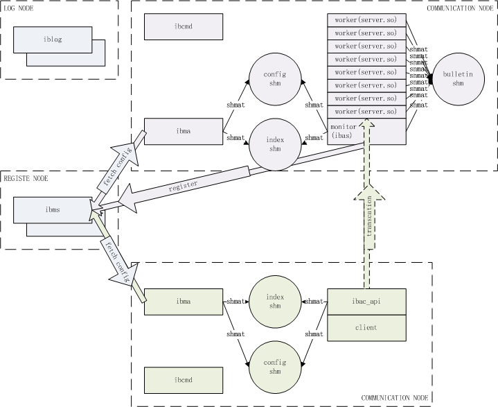
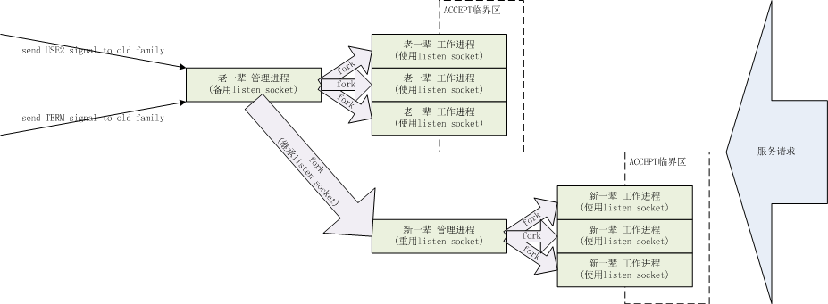

分布式联机服务技术框架(IBP)设计与实战（一、概述，小甜点）
=========================================

| 版本号 | 修订日期 | 修订人 | 内容 |
| --- | --- | --- | --- |
| 0.0.1.0 | 2018-01-21 | 厉华 | 创建 |

<!-- TOC -->

- [1. 概述](#1-概述)
    - [1.1. 简介](#11-简介)
    - [1.2. 九大模块](#12-九大模块)
    - [1.3. 体系架构](#13-体系架构)
    - [1.4. 比传统SOAP、微服务等做了哪些主要改进](#14-比传统soap微服务等做了哪些主要改进)
    - [1.5. 功能与优势](#15-功能与优势)
- [2. 开胃甜点](#2-开胃甜点)
    - [2.1. 应用不停机热更](#21-应用不停机热更)
    - [2.2. 平台不停机升级](#22-平台不停机升级)
    - [2.3. 一写多读无锁算法](#23-一写多读无锁算法)
    - [2.4. 密钥平滑同步](#24-密钥平滑同步)
    - [2.5. 业务逻辑管理框架和分阶段模板](#25-业务逻辑管理框架和分阶段模板)
    - [2.6. 动态结构容器](#26-动态结构容器)
    - [2.7. 应用崩溃栈输出](#27-应用崩溃栈输出)
    - [2.8. 日志收集](#28-日志收集)

<!-- /TOC -->

# 1. 概述

## 1.1. 简介

IBP(InterBankPlus)脱胎于银行核心系统平台分布式服务改造而生，借鉴了SOAP、ESB、微服务等架构理念，根据银行金融环境做适应性调整，充分考虑配置和应用包统一管理、集群热伸缩性、高可靠容错性、实时低延迟，设计成全新的松耦合分布式架构，特别适合联机服务技术框架。

* **分布式** 不仅仅是集群和负载均衡，还有应用解耦、事务一致性、日志归集等
* **联机** 要求高并发、低延迟
* **服务** 意味着配置、应用包统一管理
* **技术框架** 即高可靠PaaS

IBP为了实现性能极致，核心完全用C自研，代码约9万行，分九大模块，代码结构清晰，注释丰富，易于阅读和改造，还大量使用代码自动化生成技术，减轻了底层细节编码压力。

IBP已于2017年11月随某行ECIF业务平台投产，运行至今稳定高效。

## 1.2. 九大模块

| 模块名 | 模块简述 | 源码目录 |
| --- | --- | --- |
| 公共层 | 通讯协议接口定义、公共函数与工具 | src/idl,src/util,src/tools |
| 注册中心 | 统一管理配置、应用包的维护、下发 | src/ibms |
| 注册代理 | 注册中心在各个通讯节点的配置、应用包管理代理 | src/ibma |
| 通讯客户端API | 客户端应用调用通讯客户端API向通讯服务端平台发起服务请求 | src/ibac |
| 通讯服务端平台 | 通讯服务端平台接受客户端API发起的服务请求，处理后响应回客户端 | src/ibas |
| 报文转换层 | 应用与通讯之间的数据格式转换，目前支持JSON、XML | src/ibmsgv |
| 交易管理层 | 定义应用处理单元规范，组合执行流以及一些公共函数；结构树数据总线；动态结构容器 | src/ibtm |
| 交易分阶段模板层 | 分阶段模板，整合应用处理单元，插拔业务逻辑 | src/ibts |
| 远程命令代理 | 受控后门，可以执行远程命令管理其它模块 | src/ibcmd |

## 1.3. 体系架构

* **注册节点.注册中心**：负责统一管理集群通讯配置，接受通讯节点配置变动订阅，智能推导自动下发配置、应用包和密钥。

* **通讯节点.注册代理**：负责与注册节点保持长连接，主动和被动获取最新配置、密钥和应用包，构造、维护本地配置副本共享内存供通讯服务端平台和通讯客户端API等访问使用。

* **通讯节点.通讯客户端API**：被通讯客户端调用，从配置共享内存查询配置，生产服务请求到通讯服务端平台处理。支持长短环境句柄、长短连接、并行请求等满足不同客户端需求。

* **通讯节点.通讯服务端平台**：服务消费端处理客户端API上送的服务处理请求，并与注册中心做心跳监控。拥有三大服务模式：即时创建短进程、静态进程池、动态进程池和调试模式，以适应不同服务器资源配置。拥有应用包不停机热更、通讯平台不停机热升级、应用资源泄露防御、三层超时清理等机制构建起强大的应用服务平台。

## 1.4. 比传统SOAP、微服务等做了哪些主要改进

* 注册节点在整个体系中解耦，当僵死或崩溃失效时，不影响整个系统体系的正常运作（传统SOA的注册节点因为是逻辑单点，必须通过多机、选举算法等复杂设计以确保注册节点高可靠）。

* 服务低延迟。传统SOA每次发起服务请求前都要去注册中心查询服务消费方位置，IBP设计了通讯节点配置副本机制避免了多余的通讯成本，进而又加入了注册代理以实时同步配置，又设计了一写多读无锁算法提高配置副本共享内存并发访问性能。

* 基于客户端API感知服务端负载的负载均衡软实现，比单纯客户端分发效果更优。

* 通讯服务端应用热更，甚至平台升级时完全不需要对外中断服务。传统SOA、微服务只能采取负载均衡端配合暂禁、重启、解禁等滚动更新，繁琐易错，可能还会损坏正在发生的服务请求。

## 1.5. 功能与优势

* 基于“注册节点-通讯节点（通讯服务端平台、通讯客户端API）”的系统全解耦的分布式基础架构设计，任何一个节点出问题不会影响整体运作，即使是注册节点。

* 支持大规模集群热伸缩，注册中心批量或自动立即智能推导分发集群配置、应用包和密钥热部署热更新，避免手工变更带来的巨大工作量、耗时和误操作风险。支持集群化一键式管理。

* 全套核心用C语言实现，数据结构优化和性能调优，真正达到毫秒级服务能力。

* 通讯节点精心设计了一写多读无锁算法管理配置副本共享内存，提供给客户端API、服务端等使用，为大并发容载提供可能。

* 简洁易用丰富的三层客户端API根据需要灵活选用，并实现了并行交易API，以及在并行交易API基础上实现了一个分布式服务调度引擎（二阶段提交）。客户端和服务端采用基于负载因子反馈的负载均衡算法。

* 强大的通讯服务端平台。支持四大服务端模式：即时创建短进程、静态工作进程池、动态工作进程池和调试模式；拥有长进程资源泄露防御、三层超时清理机制等异常情况自动恢复；拥有inotify配合的动态库打开句柄缓存池以提高性能；每笔交易报文可附带最多四个附加文件实现交易请求数据灵活性；优雅重启机制实现在线重载配置、平台主程序不停机升级；应用崩溃时自动输出现场函数栈到日志便于应用开发人员直接定位问题语句；事件日志+通讯日志+交易日志三层日志体系，输出每笔交易的内部处理耗时分布以应用分析调优...

* 采用开放的HTTP和JSON作为默认通讯协议和报文格式，为接口扩展提供了灵活性，也便于各业务团队自由选择自己熟悉的技术环境和工具栈接入。精心设计的通讯四分组增加了通讯交换的可靠性、尽量减小可疑交易的可确认范围。

* 基于非对称+对称的通讯数据安全保护。压缩和签名机制确保通讯性能和数据完整性校验。

* 平台代维护和下发热更应用自用配置缓存服务。

* 交易管理层实现了分阶段模板执行引擎+可变层次交易单元函数树，既规范了交易分层配置，又不失函数组装灵活性。结构树实现了以静态结构体为单位的应用层数据总线。动态结构对象用于模块与模块之间安全的交换数据（C语言结构体是不安全的）。

* 日志远程归集采用了作者另开源的日志工具logpipe，提供异步、实时日志流收集架构能力。

# 2. 开胃甜点

详细介绍体系架构前先来一点开胃甜点

## 2.1. 应用不停机热更

一般应用包更新都通过负载均衡端配合的滚动更新来实现，但这样会造成流程繁琐易错、自动化程度要求高、更新周期长等问题，IBP通讯服务端实现了无需其它端配合的应用不停机热更。

IBP通讯服务端平台采用动态库方式挂接应用包执行应用逻辑，处理完一次请求后缓存动态库打开句柄到内部缓存池（红黑树数据结构）中，同时通过inotify订阅磁盘上动态库文件变化主动通知，下一次相同服务请求到来后直接用缓存池中打开句柄立即开始应用处理，当注册代理接收到最新应用包后会更新磁盘上的动态库文件，引发通讯服务端平台在空闲时接收处理到动态库文件变动通知，清理缓存池中的打开句柄，下一次相同服务请求到来后新打开新版本应用包。

动态库打开句柄缓存池的作用是避免频繁的装载、定位函数指针、卸载动态库动作，大幅提高性能。inotify订阅变化的作用是及时主动通知应用包更新事件。

可集群化并行执行，实现秒级应用更新。

## 2.2. 平台不停机升级

传统的平台主程序升级（打补丁）必须停机，IBP通讯服务端实现了平台不停机自我升级，好比是在一辆高速行驶的汽车上把地盘换掉，这将大大方便运维管理。

IBP通讯服务端由管理进程和工作进程组组成（静动态进程池模式），当要更新平台时，首先更新好磁盘上的平台程序和库，然后发送USR2信号给管理进程，管理进程创建新一代管理进程（代码映像取自磁盘上最新版本），并把侦听端口继承给它，新一代管理进程初始化成功后创建新一代工作进程组，此时新老两代进程池同时处理服务请求，确认新一代正常工作后，发送TERM信号给老一代管理进程做优雅结束。

整个控制流程包装成shell做自动化控制，每一步都输出阶段性提示。

可集群化并行执行，实现秒级平台更新。

Dubbo、Spring cloud有此功能吗？

## 2.3. 一写多读无锁算法

一般共享内存的使用如果涉及写或更新总是需要加一个锁防止脏数据，即使读写锁也会一定程度上影响应用的并发性，IBP在架构上实现了一种无锁算法。

每个通讯节点里的注册代理首次向注册中心索要配置后会构建本地索引共享内存和配置共享内存，索引共享内存key对外公开，内部存放配置共享内存key，配置共享内存key不对外公开，内部存放了索要到的所有配置，这样，本地应用（通讯客户端API、通讯服务端平台通过索引共享内存连接到配置共享内存，通过注册代理模块API查询配置）。注册代理与注册中心保持长连接做配置变更订阅，一旦又新配置下发下来，注册代理构建一块新的配置共享内存，让索引共享内存指向之，本地应用在活跃时会检查如果存在新配置共享内存则转连之，老配置共享内存在无应用进程连接时会被注册代理清除回收。

因为没有锁，所以应用的并发性影响降低到极致。

其实也不是完全没有锁，通讯客户端API在感知服务端负载时会保存一些信息到配置共享内存中供下次负载均衡使用，但是保存过程使用了CAS无堵塞方式更新，因为这种更新可以容忍丢失，所以只会尝试一次。

## 2.4. 密钥平滑同步

在金融安全架构中，系统间通讯密钥有定期更新要求。跨机密钥同步期间往往会因为新老密钥不一致造成短暂不可用，如果交易量大时，损失度往往不可接受，IBP通讯节点之间采用了密钥平滑同步机制解决了这一问题。

注册中心统一变更通讯配置中的密钥，自动推导下发给所有涉及的通讯节点，通讯节点里的注册代理接收和落地的时间点可能会存在差异。服务发起方接收到新密钥后定义一个新密钥启用时间点，在此点前仍然用老密钥加密业务报文，在此点后切换用新密钥加密业务报文，同时都附上密钥校验值。服务处理方接收到新密钥后也定义一个老密钥失效时间点，在此点前根据密钥校验值容忍新老密钥同时有效工作，在此点后强制使用新密钥。两端配合构建新老密钥过渡期，实现密钥平滑同步。

## 2.5. 业务逻辑管理框架和分阶段模板

很多分布式服务框架往往都缺少业务逻辑管理框架，IBP总结上一代银行核心业务逻辑管理框架，优化改造出新版。

分阶段公共检查、业务检查、业务处理、账务处理、外联远程调用的常用组合，封装成几套模板，应用开发人员选用一套，挂接业务逻辑函数树到分阶段模板上，即能快速构建业务服务，达到敏捷开发能力。

函数树层次自由，根据业务复杂性自由编排。

## 2.6. 动态结构容器

当项目规模越来越大，模块越来越多，开发团队越来越细分，不可避免要做模块化和模块解耦，系统内模块间接口版本管理显得越来越重要，一种架构层面解决方案是采用微服务，但微服务单个实例中还是存在多模块交互问题。

之前的C栈项目实践中发现，模块间函数调用业务字段都包装在单个结构体内，当底层模块使用结构定义改变后如果上层涉及模块没有及时全编译可能运行时会造成地址crash，要解决这个问题首先得让程序能主动发现和防御，IBP设计了动态结构容器来实现运行时应用主动发现，而不是被动crash。

动态结构容器原理非常简单，调用方根据接口定义，构建动态结构容器（树），把字段都压入容器（挂接树上），然后调用被调用方，被调用方从容器中把字段都弹出来（从树上卸下来）并做安全检查，如果发现不符合接口规格的立即返回接口不一致错误，树的构建是运行时操作的，这样就能运行时主动防御接口变动而有部分代码未全编译的问题。

动态结构容器实现的难点是如何尽量简化应用开发人员的使用心智负担，IBP使用可变参数宏封装简化了底层复杂性。

## 2.7. 应用崩溃栈输出

JAVA应用异常时都会抛出方法栈便于开发人员定位问题，IBP使用GNUC提供的backtrace函数族也可轻松获取当前或coredump时的运行函数栈，平台会捕获coredump事件，收集函数栈信息输出到日志，使得C开发人员也能享受到同等待遇。

## 2.8. 日志收集

目前主流日志收集工具flume-ng、filebeat等都采用轮询机制，无法实现毫秒级收集延迟，IBP作者加入其开源工具logpipe到IBP项目中，基于Linux文件系统inotify主动通知机制，订阅监控目录里的新建文件和文件内容追加事件，应用日志库只关注输出日志即可，日志文件大小转档和采集都由logpipe负责，这样通过磁盘文件解耦了应用写日志和日志采集，降低了日志基础设施复杂性、提高了日志库运行时性能和稳定性，又能异步、毫秒级延迟的实时采集走日志到日志独立存储或ES或HDFS，占用系统资源（最多个位数CPU，10MB上下内存，启用了压缩还能大幅减少网络带宽占用）非常小。
