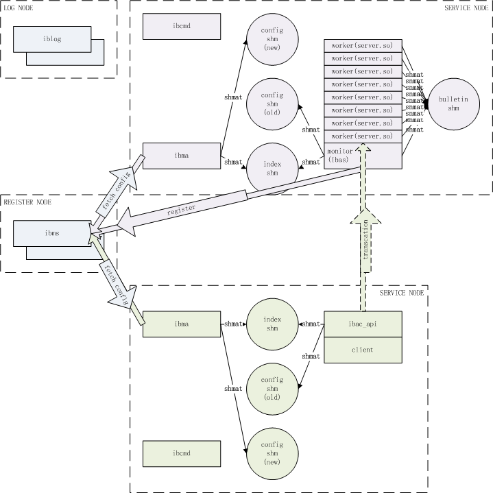

分布式联机服务技术框架(IBP)设计与实战（二、平台体系架构）
=========================================

| 版本号 | 修订日期 | 修订人 | 内容 |
| --- | --- | --- | --- |
| 0.0.1.0 | 2018-01-27 | 厉华 | 创建 |

<!-- TOC -->

- [1. 总体架构](#1-总体架构)
    - [1.1. 注册节点](#11-注册节点)
    - [1.2. 通讯节点](#12-通讯节点)
- [2. 架构模块](#2-架构模块)
    - [2.1. 集群配置结构](#21-集群配置结构)
    - [2.2. 注册中心（ibms）](#22-注册中心ibms)
    - [2.3. 注册代理（ibma）](#23-注册代理ibma)
    - [2.4. 通讯客户端API（ibac）](#24-通讯客户端apiibac)
        - [2.4.1. 低层函数集](#241-低层函数集)
        - [2.4.2. 中层函数集](#242-中层函数集)
        - [2.4.3. 调用流程](#243-调用流程)
        - [2.4.4. 负载均衡算法](#244-负载均衡算法)
        - [2.4.5. 临时文件名格式](#245-临时文件名格式)
        - [2.4.6. 通讯收发函数参数特别说明](#246-通讯收发函数参数特别说明)
        - [2.4.7. 交易可疑状态查询](#247-交易可疑状态查询)
        - [2.4.8. 并行交易（未跟上最新版本）](#248-并行交易未跟上最新版本)
        - [2.4.9. 二阶段提交（未跟上最新版本）](#249-二阶段提交未跟上最新版本)
    - [2.5. 通讯服务端平台（ibas）](#25-通讯服务端平台ibas)
        - [2.5.1. 进程结构](#251-进程结构)
        - [2.5.2. 通讯接入](#252-通讯接入)
        - [2.5.3. 应用包打开句柄缓存池](#253-应用包打开句柄缓存池)
        - [2.5.4. 应用包接口](#254-应用包接口)
        - [2.5.5. 工作进程生命周期](#255-工作进程生命周期)
        - [2.5.6. 三层超时清理](#256-三层超时清理)
        - [2.5.7. 应用包不停机热更原理](#257-应用包不停机热更原理)
        - [2.5.8. 通讯服务端平台不停机热更原理](#258-通讯服务端平台不停机热更原理)
    - [2.6. 远程命令代理（ibcmd）](#26-远程命令代理ibcmd)
    - [2.7. 集群管理](#27-集群管理)
        - [2.7.1. 集群启停](#271-集群启停)
        - [2.7.2. 集群伸缩](#272-集群伸缩)
    - [2.8. 集群日志收集（logpipe）](#28-集群日志收集logpipe)
        - [2.8.1. 日志归集端](#281-日志归集端)
        - [2.8.2. 日志采集端](#282-日志采集端)
        - [2.8.3. 其它日志归档](#283-其它日志归档)

<!-- /TOC -->

# 1. 总体架构


IBP体系架构采用全解耦式设计。

## 1.1. 注册节点

注册节点主要部署注册中心。

**注册中心(ibms)**

注册节点主要负责接受管理自身客户端连接，接收处理维护集群配置指令、接收触发自动推导下发配置和应用包、接收触发保存配置到磁盘等；接受各通讯节点注册代理连接，被索取本节点和关联节点配置，接收订阅配置变动事件；接受通讯服务端平台连接，建立心跳监测。

全体系只有一个注册中心实例，由于松耦合架构，即使异常也不会对当时和后续服务请求产生影响，也无需引入选举等复杂算法操控。唯一要注意的是要做好落地配置冗余，额外设置远程落地集群配置副本。

## 1.2. 通讯节点

众多通讯节点组成节点网，交易请求从一个节点到另一个节点。通讯节点既可以有客户端，也可以有服务端，或者同时有客户端和服务端。

**注册代理**



每个通讯节点内有一个注册代理，负责连接注册中心取回属于本节点和关联节点的配置，构建本地索引共享内存和配置共享内存，并与注册中心保持连接订阅配置变动事件。

索引共享内存和配置共享内存被本地通讯客户端API和通讯服务端平台连接，通过注册代理API访问其中配置信息。索引共享内存KEY对外公开，配置共享内存KEY私有，存放在索引共享内存中，本地应用先连接索引共享内存即可知道当前最新配置共享内存KEY连接之。配置共享内存内布局被精心设计成高效查询数据结构。

注册代理一旦得到新配置，构建新配置共享内存，然后把索引共享内存指向新配置共享内存。注册代理维护着一组配置共享内存信息链，并周期性检查老版配置共享内存如果没有其它应用连接就删除清理。通讯客户端API和通讯服务端平台在空闲时会调用注册代理API检查转连最新配置共享内存。

注册代理处理新配置时也会检查应用包签名和本地签名是否一致，如果不一致则联动向注册中心请求下发新版应用包。

通讯客户端API除了保存侦测到的通讯服务端平台负载覆写到配置项内存外，没有其它写操作，前者采用CAS方式更新数据，如果失败则放弃更新。

所以配置共享内存无需任何锁保护，这能完全避免对并发处理的性能损耗。

**通讯客户端API**

通讯节点内可部署通讯客户端API，提供给客户端应用调用以发起交易。

通讯客户端API支持长短环境句柄、长短连接、并行交易等多种场景选用；支持交易附带多个请求文件和多个响应文件；支持通讯失败时细粒度识别交易是否可疑。

通讯客户端API在并行交易基础上实现了分布式事务二阶段提交。

通讯客户端API在处理交易时会请求服务端附带负载信息回来，保存在配置共享内存供本节点所有通讯客户端API下次交易时负载均衡挑选服务端用。

**通讯服务端平台**

通讯节点内可部署通讯服务端平台，负责接受通讯客户端发起交易的后端业务逻辑处理。

通讯服务端平台进程结构一般由管理进程和一组工作进程组成。选用多进程而非多线程是考量当业务逻辑导致系统异常时的隔离性。

通讯服务端平台支持三种服务模式：即时创建短进程模式，管理进程接受到交易时创建工作进程处理交易，处理完销毁工作进程，适合在系统资源较少的环境；静态进程池模式，管理进程启动时创建一组工作进程，以Leader-follow方式在ACCEPT临界区保护下争夺交易连接并处理之；动态进程池模式在静态进程池模式上拥有根据当前负载自动伸缩工作进程池。

通讯服务端平台进程池工作进程处理可配置数量交易后自动重启，以周期性回收泄露内存、描述字，解决业务逻辑代码缺陷造成的资源泄露，使工作进程池始终保持健康。

通讯服务端平台管理进程监控工作进程工作时长，如发现有业务逻辑代码死循环、处理时间过长、僵死等情况时及时清退工作进程，使工作进程池始终保持活力。

通讯服务端平台通过加载包含业务逻辑的动态库（应用包）实现业务处理，动态库使用后保存打开句柄到缓存池中供下次直接使用以提高性能，同时注册文件系统主动通知监控磁盘文件变动。

# 2. 架构模块

## 2.1. 集群配置结构

IBP集群配置分为通讯节点信息、交易码配置、项目信息（通讯节点与交易码关系，用于推导）。

**通讯节点信息**

通讯节点信息包含节点名、状态、节点主机集群IP和PORT、应用自定义KV配置。

通讯节点信息配置etc/ibp_nodes.conf示例：
```
{
	"nodes" :
	[
	{
		"node" : "ECIF" ,
		"invalid" : "0" ,
		"hosts" :
		[
		{ "ip" : "158.1.0.56" , "port" : 18001 } ,
		{ "ip" : "158.1.0.57" , "port" : 18001 } ,
		{ "ip" : "158.1.0.58" , "port" : 18001 }
		]
	} ,
	{
		"node" : "CORE" ,
		"invalid" : "0" ,
		"hosts" :
		[
		{ "ip" : "66.88.1.10" , "port" : 10601 }
		]
	} ,
    ...
}
```

**交易码信息**

交易码信息包含交易码、交易描述、应用包名（动态库文件名）、客户端通讯超时时间、服务端应用超时时间、缺省服务端节点名、状态。当服务端应用超时时间为0是自动按通讯超时*1.5计算。

交易码信息配置etc/ibp_apps.conf示例：
```
{
	"apps" :
	[
	{
		"app" : "ibp_test_echo" ,
		"desc" : "测试报文回射服务" ,
		"bin" : "ibp_test_echo.so" ,
		"timeout" : "50" ,
		"timeout2" : "0" ,
		"invalid" : "0"
	} ,
	{
		"app" : "ibp_test_file" ,
		"desc" : "测试文件回射服务" ,
		"bin" : "ibp_test_file.so" ,
		"timeout" : "120" ,
		"timeout2" : "0" ,
		"invalid" : "0"
	} ,
    ...
}
```

**项目信息**

项目信息包含项目名、服务端节点集群、客户端节点集群、交易码集合。

项目信息配置etc/ibp_projects.conf示例：
```
{
	"projects" :
	[
	{
		"project" : "echo_project" ,
		"server_nodes" : "ECIF" ,
		"client_nodes" : "CORE" ,
		"apps" : "ibp_test_echo ibp_test_file"
	} ,
	...
	]
}
```

## 2.2. 注册中心（ibms）

注册中心父进程启动后装载主配置文件到内存挂接成红黑树结构，转换自己为守护进程，创建子进程并监控之。

主配置文件`etc/ibms.conf`示例：
```
{
	"ibms" :
	{
		"server" : // 服务器配置
		{
			"ip" : "158.1.0.54" ,
			"port" : 16001
		} ,
		
		"config" : // IBP集群配置文件名
		{
			"nodes_conf" : "ibp_nodes.conf" , // 通讯节点信息配置文件名
			"apps_conf" : "ibp_apps.conf" , // 交易码信息配置文件名
			"projects_conf" : "ibp_projects.conf" // 项目信息配置文件名
		} ,
		
        "security" : // 安全机制配置
        {
            "old_key_disable_elapse" : 120 , // 老密钥失效时间（单位：秒）
            "new_key_enable_elapse" : 60 // 新密钥生效时间（单位：秒）
        } ,

        "misc" : // 杂项配置
        {
            "auto_download_bin_enable" : 0 , // 是否启用立即自动推导下发应用包
            "second_config_dump" : "158.1.0.55:26001" // 冗余落地配置副本的ibcmd地址
        } ,

		"log" : // ibms日志配置
		{
			"iblog_server" : "" , // 该选项已弃用，改用logpipe实现大小转档和异步实时日志收集
			"event_output" : "file::log/event.log" , // 事件日志文件名
			"main_output" : "file::log/ibms_main.log" , // 启动初始化日志文件名
			"main_loglevel" : DEBUG , // 启动初始化日志等级
			"monitor_output" : "file::log/ibms_monitor.log" , // 注册中心父进程日志文件名
			"monitor_loglevel" : INFO , // 注册中心父进程日志等级
			"worker_output" : "file::log/ibms_worker.log" , // 注册中心子进程日志文件名
			"worker_loglevel" : INFO // 注册中心子进程日志等级
		}
	}
}
```

子进程通过多路复用等待接受侦听端口连接、接收已连接会话通讯数据并返回处理结果。

当要停止注册中心时，发送SIGTERM信号给父进程，父进程通过匿名管道发送退出命令给子进程，子进程处理完手头工作后结束，父进程清理环境后也结束。

子进程接受注册中心命令客户端、图形客户端连接，接收增删改查配置指令并返回处理结果，也接收开始自动推导下发配置、下发应用包、保存配置到磁盘等指令并返回处理结果。

子进程也接受通讯节点注册代理连接，提供该节点及关联节点配置，接受订阅配置变动事件，也便于注册中心监测所有通讯节点的注册代理生存情况。

子进程也接受通讯服务端连接，并保持心跳，以便在注册中心监测所有通讯服务端生存情况。

子进程对外接口采用通讯协议采用RESTful API，报文格式采用JSON（压缩）。

当开启配置`ibms.misc.auto_download_bin_enable`为1时，实时监控应用包目录`$HOME/so/`，一旦发生新建或更新应用包事件则立即自动推导下发应用包。

当配置`ibms.misc.second_config_dump`有值时，当落地保存集群配置后再落地一份集群配置到目标环境（通过ibcmd）。

当集群配置很多时，启动注册中心装载配置耗时将很长。IBP引入预编译配置机制，预读入集群配置导出内存镜像成二进制文件（文件名为对应配置文件加后缀`.bin`，如`ibp_nodes.conf`的二进制镜像文件为`ibp_nodes.conf.bin`），下次启动时如果发现有二进制镜像文件则直接装载，省却解析配置过程，使得装载巨量配置在瞬息之间。

## 2.3. 注册代理（ibma）

注册代理进程启动后装载主配置文件，连接注册中心索要本节点配置和相关节点配置（涉及应用包检查本地版本与注册中心版本是否一致，如果不一致则自动联动请求下发最新版本），构造本地索引共享内存（如果存在则刷新）和配置共享内存，转换自己为守护进程。

主配置文件`etc/ibma.conf`示例：
```
{
        "ibma" :
        {
                "this_node" : "ECIF" , // 本节点名

                "comm" :
                {
                        "min_compress_size" : 16 // 当HTTP体大于该大小时自动启用压缩
                } ,

                "log" :
                {
                        "iblog_server" : "" ,
                        "event_output" : "file::log/event.log" ,
                        "main_output" : "file::log/ibma_ECIF_127.0.0.1:18111_main.log" ,
                        "main_loglevel" : INFO ,
                        "worker_output" : "file::log/ibma_ECIF_127.0.0.1:18111_worker.log" ,
                        "worker_loglevel" : INFO
                }
        } ,

        "ibac" :
        {
				"connecting_timeout" : 10 // 客户端连接(connect)服务端超时时间（单位：秒）
                "retry_connect_timeval" : 60 , // 当连接失败后暂禁时间段（单位：秒）
        } ,

        "ibms" :
        {
                "server" :
                {
                        "ip" : "127.0.0.1" , // 注册中心IP
                        "port" : 16001 // 注册中心PORT
                }
        }
}
```

进程订阅注册中心集群配置变动事件，如果发生事件则重新构造新配置共享内存，串入配置共享内存链，刷新索引共享内存内的配置共享内存KEY。

进程周期性检查配置共享内存链，如果有老版配置共享内存除了注册代理外没有其它进程相连，清除该配置共享内存。

索引共享内存内布局：

| 区号 | 内容 | 大小 |
| --- | --- | --- |
| 第一区 | 最新版配置共享内存KEY | sizeof(key_t) |

配置共享内存内布局：

| 区号 | 内容 | 大小 |
| --- | --- | --- |
| 第一区 | 头结构信息，包含本节点名等主配置信息、通讯节点数量等集群配置概要信息等 | 头结构大小 |
| 第二区 | 哈希存放通讯节点信息，用于高效查询 | 通讯节点信息结构大小×数量x哈希膨胀因子 |
| 第三区 | 顺序存放通讯节点主机信息，第二区中的每一个通讯节点信息都指出所属该节点的主机集群信息存放开始地址和结束地址 | 所有通讯节点主机信息结构大小×数量 |
| 第四区 | 哈希存放交易码信息，用于高效查询 | 交易码信息结构大小×数量x哈希膨胀因子 |
| 第五区 | 哈希存放应用自定义KV信息，用于高效查询 | 应用自定义KV信息结构大小×数量x哈希膨胀因子 |

注册代理对外提供API给通讯客户端API和通讯服务端平台用以连接共享内存、检查转连、访问各类集群配置。

## 2.4. 通讯客户端API（ibac）

通讯客户端API是一个函数库，不假设应用进程结构、信号灯环境等系统环境设置，适应各种各样的客户端系统环境场景。

通讯客户端API提供了低层、中层两层函数集合给客户端应用，适应各种各样的客户端调用场景。

### 2.4.1. 低层函数集

**环境类**

```
/* 创建ibac环境 */
struct IbacEnv *IBACCreateEnvirment( char *config_filename );
/* 销毁ibac环境 */
void IBACDestroyEnvirment( struct IbacEnv *p_env );
```

**连接类**

```
/* 连接服务端 */
int IBACConnect( struct IbacEnv *p_env , char *node , char *app );
/* 断开服务端 */
void IBACDisconnect( struct IbacEnv *p_env );
```

**通讯收发类**

```
/* 发送请求和接收响应 */
int IBACSendRequestAndReceiveResponse( struct IbacEnv *p_env , char *app , char **pp_msg , int *p_msg_len , ... );
```

### 2.4.2. 中层函数集

```
/* 连接服务端，发送请求和接收响应，断开服务端 */
int IBACRequester( struct IbacEnv *p_env , char *node , char *app , char **pp_msg , int *p_msg_len , ... );
```

### 2.4.3. 调用流程

**长短进程**

短进程：先创建ibac环境（内部调用注册代理API连接最新版配置共享内存、内部环境初始化），发起交易，销毁ibac环境。

长进程：创建ibac环境，反复使用同一个ibac环境发起交易，进程退出前销毁ibac环境。

**长短连接**

短连接：发起交易前调用连接服务端，收发通讯数据，断开服务端。

长连接：连接服务端，反复使用这条连接收发通讯数据，最后断开服务端。（长连接能提高通讯效率，但也会使负载均衡能力减弱）。

### 2.4.4. 负载均衡算法

当此交易响应通讯报文中夹带服务端负载信息（工作状态进程数量/进程总数量），通讯客户端API以CAS方式覆写到配置共享内存，写失败则丢弃。下笔交易发起连接服务端时，挑选服务端负载压力最小的主机。

### 2.4.5. 临时文件名格式

IBP体系中，交易业务报文还能附带文件，即临时文件。

代码中临时文件名变量定义如下：

`char req_filename[ IBP_MAXLEN_FILENAME + 1 ] ;`

临时文件必须都存放在`$HOME/file/`目录里，可以使用IBP创建临时文件函数创建

`FILE *IBPCreateTempFile( char *file_id , char *filename , char *pathfilename , char *mode )`

临时文件名格式为：

`(file_id)_(10个可见随机字符).tmp`

在接收端，使用`file_id`来获取指定类临时文件。

### 2.4.6. 通讯收发函数参数特别说明

参数`*pp_msg`输入时指向业务请求报文地址，输出时修改成指向业务响应报文地址（存放缓存区在ibac环境中托管分配，无需应用控制）。如果调用后客户端应用还要访问业务请求报文缓冲区，请在调用前做好地址备份。

参数`*p_msg_len`输入时存放业务请求报文大小，输出时修改成业务响应报文大小。

最后参数`...`，指出交易附带文件集合，格式为：

`,（0~n个请求附带文件名列表）,NULL,（0~n个响应附带文件名列表）,NULL`

比如无请求响应附带文件：

`,NULL,NULL`

比如有一个请求附带文件，没有响应附带文件：

`,req_filename,NULL,NULL`

比如没有请求附带文件，有两个响应附带文件：

`,NULL,rsp_filename1,rsp_filename2,NULL`

比如有三个请求附带文件，有两个响应附带文件：

`req_filename1,req_filename2,req_filename3,NULL,rsp_filename1,rsp_filename2,NULL`

### 2.4.7. 交易可疑状态查询

IBP通讯协议设计保证当通讯失败时告知应用该交易是否可疑

```
int IBACGetCommStatus( struct IbacEnv *p_env );
```

当该函数返回`IBAC_COMM_STATUS_ON_SENDING`时说明交易处于可疑状态，需要追加执行业务查证交易、反交易、冲正交易，或通知人工介入。

### 2.4.8. 并行交易（未跟上最新版本）

并行交易允许客户端应用同时向多个通讯节点发送交易，并行等待直到所有响应都收妥，或者通讯失败。

**连接类**

```
struct IbacMultiRequesters
{
        char                    *node ; /* IBP通讯节点 */
        char                    *app ; /* 交易码 */
        char                    **pp_msg ; /* 请求报文 或 响应报文 */
        int                     *p_msg_len ; /* 请求报文长度 或 响应报文长度 */
        struct IbacAddonFiles   req_files ; /* 请求文件数组 */
        struct IbacAddonFiles   rsp_files ; /* 响应文件数组 */
} ;

/*
struct IbacMultiRequesters a_multi_requesters[] =
        {
                { "ibma-1" , "TESTTPS1" , & p_msg1 , & msg1_len , { NULL } , { NULL } } ,
                { "ibma-2" , "TESTTPS2" , & p_msg2 , & msg2_len , { req2_filename1 , req2_filename2 } , { rsp2_filename1 , rsp2_filename2 } }
        } ;

*/

/* 连接服务端集 */
int IBACMultiConnect( struct IbacMultiEnvs *p_multi_envs , struct IbacMultiRequesters *multi_requesters );
/* 断开服务端集 */
void IBACMultiDisconnect( struct IbacMultiEnvs *p_multi_envs , struct IbacMultiRequesters *multi_requesters );
```

**通讯收发类**

```
/* 发送并行交易请求并接收响应 */
int IBACMultiSendRequestsAndReceiveResponses( struct IbacMultiEnvs *p_multi_envs , struct IbacMultiRequesters *multi_requesters );
```

**查询是否交易可疑**

```
/* 得到通讯状态 */
int IBACMultiGetCommStatus( struct IbacMultiEnvs *p_multi_envs );
```

### 2.4.9. 二阶段提交（未跟上最新版本）

基于并行交易机制，实现了二阶段提交。

**通讯收发类**

```
/* 发送二阶段提交或回滚请求并接收响应 */
#define IBAC_MULTI_COMMIT_DATABASE      1
#define IBAC_MULTI_ROLLBACK_DATABASE    0
int IBACMultiSendCommitOrRollbackAndReceiveResponses( struct IbacMultiEnvs *p_multi_envs , struct IbacMultiRequesters *multi_requesters , int commit_or_rollback_flag );
```

此函数在并行交易通讯收发后调用，需要服务端配合。

## 2.5. 通讯服务端平台（ibas）

通讯服务端平台父进程启动后装载主配置文件到内存，转换自己为守护进程。

主配置文件`etc/ibas.conf`示例：
```
{
        "ibas" :
        {
                "server" : // 服务端侦听地址
                {
                        "ip" : "158.1.0.56" , // 通讯服务端侦听IP
                        "port" : 18001 // 通讯服务端侦听PORT
                } ,
                "mpm" : // 多进程控制
                {
                        "mode" : "STATIC_WORKERPOOL" , /* FORK,STATIC_WORKERPOOL,DYNAMIC_WORKERPOOL */ // 服务模式：分别是 即时创建短工作进程、静态工作进程池、动态工作进程池
                        "max_count" : 10 , // 最大工作进程数量 或 静态保持工作进程数量
                        "DYNAMIC_WORKERPOOL" :
                        {
                                "min_idle_count" : 1 , // 最小空闲状态工作进程数量（动态进程池时有效）
                                "max_idle_count" : 5 , // 最大空闲状态工作进程数量（动态进程池时有效）
                                "create_interval" : 1 , // 每调整周期最大创建工作进程数量（动态进程池时有效）
                                "destroy_interval" : 10 , // 每调整周期最大销毁工作进程数量（动态进程池时有效）
                                "max_process_count" : 10000 // 每个工作进程处理多少交易后自动重启，以释放应用泄露的系统资源，保持工作进程健康
                        }
                } ,
				"security" : // 安全控制
				{
						"sign_flag" : 1 , // 与客户端握手时，建议双方业务报文是否签名
						"compress_flag" : 1 , // 与客户端握手时，建议双方业务报文是否压缩
						"encrypt_flag" : 1 // 与客户端握手时，建议双方业务报文是否加密 
				} ,
                "app" : // 应用包选项
                {
                        "max_so_cache_count" : 1000 // 应用包打开句柄缓存池最大缓存数量，采用LRU踢出使用最少的应用包打开句柄缓存
                } ,
                "log" : // 日志配置
                {
                        "iblog_server" : "" ,
                        "event_output" : "file::log/event.log" ,
                        "main_output" : "file::log/ibas_158.1.0.56-18001_main.log" ,
                        "main_loglevel" : DEBUG ,
                        "monitor_output" : "file::log/ibas_158.1.0.56-18001_monitor.log" ,
                        "monitor_loglevel" : INFO ,
                        "worker_output" : "file::log/ibas_158.1.0.56-18001_worker_%d.log" ,
                        "worker_loglevel" : INFO ,
                        "app_output" : "file::log/app_%s.log" ,
                        "app_loglevel" : INFO
                }
        } ,

        "ibma" :
        {
                "config_filename" : "ibma.conf" // 本地注册代理主配置文件，用于连接配置共享内存
        }
}
```

### 2.5.1. 进程结构

主配置参数`mpm/mode`设置了通讯服务端服务模式（进程结构），目前有：

| 配置参数 | 服务模式 | 说明 |
| --- | --- | --- |
| FORK | 即时创建模式 | 管理进程等待接受新连接，即时创建短工作进程处理交易，交易处理完后结束工作进程 |
| STATIC_WORKERPOOL | 静态工作进程池 | 管理进程启动后陆续创建工作进程直至进程池完整，管理进程仅负责监控工作进程异常重启，工作进程采用`Leader-follow`模型和`ACCEPT临界区`，即同一时间只有一个侦听状态工作进程进入`ACCEPT临界区`拥有`accept`权力，当新连接进来后，被其捕获，切换自身为工作状态，离开`ACCEPT临界区`去处理通讯收发、报文转换和业务逻辑，操作系统挑选堵在`ACCEPT临界区`外的一个空闲状态工作进程进入临界区，后者切换自身为侦听状态等待下一个新连接到来，前者处理完交易后切换自身为空闲状态尝试/堵在`ACCEPT临界区`外，如此前赴后继 |
| DYNAMIC_WORKERPOOL | 动态工作进程池 | 在静态工作进程池基础上增加了周期性根据进程池繁忙程度自动伸缩进程池大小 |

### 2.5.2. 通讯接入

拿到新连接的初切工作状态的工作进程会根据通讯接收到的数据判断通讯协议，交由对应的通讯适配器处理。

目前支持二进制通讯协议IB1、IB2，以及包装HTTP的IBP通讯协议。

### 2.5.3. 应用包打开句柄缓存池

每个应用包其实就是一个动态库文件，通讯平台根据通讯协议中标注的交易码，通过注册代理API查询对应动态库文件名，装载之，定位入口函数指针并调用之，调用完后缓存动态库打开句柄和入口函数指针到缓存池（红黑树）中，供下次直接使用以提高性能，同时注册文件系统主动通知该动态库文件变动事件，如发生变动则在缓存池中清理该动态库打开句柄，迫使下次使用前重新装载。

### 2.5.4. 应用包接口

平台通过入口函数进入应用包（动态库），应用包负责报文适配转换、业务逻辑处理（交易管理公共层、分阶段模板管理层、TM函数层）。

入口函数原型：

`int somain( struct HttpBuffer *req_body , struct HttpBuffer *rsp_body , struct IbasAddonFiles *addon_files );`

`req_body`是通讯接收到的业务请求报文，`rsp_body`是交易处理完待发送的业务响应报文，可以通过`struct HttpBuffer`缓冲区操作函数集读写其内容。

`addon_files`是附带文件容器，可以通过`struct IbasAddonFiles`操作函数集查询请求附带文件，压入响应附带文件。

IBP提供了报文转换层、交易管理公共层、分阶段模板层供应用代码选用规范应用开发，具体参见本系列《四、业务逻辑管理框架与分阶段模板》。

### 2.5.5. 工作进程生命周期

每个工作进程都有其生命周期。

如果配置了`app/max_so_cache_count`，则在处理指定数量交易后工作进程正常结束，管理进程捕获工作进程正常结束事件，创建新的工作进程替代老的继续工作。

如果工作进程异常结束，管理进程也会在第一时间捕获并重启进程。

### 2.5.6. 三层超时清理

由于设计或代码问题工作进程可能会有死循环、处理时间过长、进程异常僵死等情况。

工作进程切换为工作状态时，会设置闹钟，服务端应用超时时间T后触发自杀信号结束自己，结束事件会被管理进程捕获并启动新工作进程替代老工作进程。

管理进程也会周期性扫描所有工作状态工作进程，如果发现有进程处理总耗时超过1.5T则会发送TERM信号劝其结束，如果再次发现超过2T则会发送KILL信号无条件杀灭该工作进程，杀灭事件会被管理进程捕获并启动新工作进程替代老工作进程。

自动化的三层超时清理机制使得工作进程池始终长期保持健康状态，无需人工介入处理。

### 2.5.7. 应用包不停机热更原理

注册代理得到新版应用包落地成更新期应用包文件，删除磁盘上应用包文件，改名更新期应用包文件为应用包文件；通讯服务端平台工作进程空闲时接收文件系统主动通知应用包变动，如果是删除事件则清理缓存池中该应用包打开句柄，如果是改名事件则纠正文件系统监控应用包文件；通讯服务端平台接收交易后打开应用包，如打开失败则尝试打开更新期应用包。通过以上机制，可以实现理论上完全不停机应用热更，为运维带来巨大便捷。

### 2.5.8. 通讯服务端平台不停机热更原理


首先更新好磁盘上的平台程序和库，然后发送USR2信号给管理进程，管理进程创建新一代管理进程（代码映像取自磁盘上最新版本），并把侦听端口继承给它，新一代管理进程初始化成功后创建新一代工作进程组，此时新老两代进程池同时处理服务请求，确认新一代正常工作后，发送TERM信号给老一代管理进程做优雅结束。通过以上机制，可以实现理论上完全不停机平台热更，为运维带来巨大便捷。

## 2.6. 远程命令代理（ibcmd）

如果通过ssh或rsh做远程执行命令、上传下载文件，会有权限过大隐患，IBP设计了远程命令代理，部署在各个节点上，用于命令受控的执行命令和传输文件。

在节点上运行远程命令代理服务端，在远程机器上用远程命令代理客户端向服务端发送命令并执行，发送文件传输指令处理文件上传或下载。

执行远程命令前会先经过黑名单审计，尤其用于组合shell命令的分隔符等会被检查出来并拒绝执行远程命令，然后经过白名单审计，只有出现在白名单内的命令才能通过审查并执行。黑白名单配置支持'*'和'?'匹配。

远程命令代理一般用于需要隔离权限的执行一些命令场合。

## 2.7. 集群管理

注册中心发送ssh公钥给所有节点的root用户，注册中心通过无密登录直接操作所有节点主机集群。

### 2.7.1. 集群启停

所有节点主机集群配置在`$HOME/etc/ibp_cluster.conf`。

注册中心注册代理集群管理脚本`ibma_cluster.sh`管理所有节点或指定节点主机集群的注册代理的启动、停止、查询状态，以及自定义命令执行，后者包含推送最新版本IBP安装包到所有节点主机集群、解开更新包。

`ibas_cluster.sh`是类似于`ibma_cluster.sh`的集群管理脚本，只不过对象是管理通讯服务端平台，，命令参数还包含优雅重启等。

### 2.7.2. 集群伸缩

注册中心还拥有一键伸缩集群功能，注册中心通过客户端命令行或图形管理平台先维护一份已注册root权限裸机资源列表，当触发一键扩大集群指令时，注册中心远程自动操控新节点创建用户、推送解开安装包、推送实例化配置、向自己登记节点主机信息、启动注册代理、向该节点和关联节点发送下发配置和应用包指令、启动通讯服务端平台（如果设置为服务端角色），这样该节点和关联节点的本地节点配置中就增加了新增节点主机信息。

一键缩小集群同理。

## 2.8. 集群日志收集（logpipe）

老版日志归集采用IBP日志库的远程推送和日志服务器`iblog`来实现，但考虑到同步推送日志（即使只推送`event.log`）对交易处理的影响，就用本人以前自研的开源日志收集工具`logpipe`来代替。

logpipe是一个分布式、高可用的用于采集、传输、对接落地的日志工具，采用了插件风格的框架结构设计，支持多输入多输出按需配置组件用于流式日志收集架构，无第三方依赖。

logpipe的输入文件插件支持异步实时的采集日志，输出文件插件支持以相同文件名落地日志，输出TCP插件支持负载均衡轮询发送日志以规避单节点故障造成传输断点，以上这些特性正是IBP日志收集架构所需要。

使用`logpipe`配置日志采集端和日志归集端非常简单。

### 2.8.1. 日志归集端

在日志服务器上部署日志归集端以落地日志到统一存储，也要控制单个日志文件最大大小。

```
$ cat $HOME/etc/logpipe.conf
{
        "log" : 
        {
                "log_file" : "/tmp/logpipe_log.log" ,
                "log_level" : "WARN"
        } ,

        "inputs" : 
        [
                { "plugin":"so/logpipe-input-tcp.so" , "ip":"158.1.0.55" , "port":10101 }
        ] ,

        "outputs" : 
        [
                { "plugin":"so/logpipe-output-file.so" , "path":"/home/iblog/log" , "rotate_size":10000000 }
        ]
}
```

用以下命令启用日志归集端

```
$ logpipe -f $HOME/etc/logpipe.conf
```

### 2.8.2. 日志采集端

在注册中心、所有通讯节点部署日志采集端以异步实时采集日志，同时还控制单个日志文件最大大小，配置大小转档后的日志文件立即删除。

```
$ cat $HOME/etc/logpipe.conf
{
        "log" : 
        {
                "log_file" : "/tmp/logpipe_log.log" ,
                "log_level" : "WARN"
        } ,

        "inputs" : 
        [
                { "plugin":"so/logpipe-input-file.so" , "path":"/home/ecif/log" , "rotate_size":10000000 , "exec_after_rotating":"rm -f ${LOGPIPE_ROTATING_NEW_FILENAME}" }
        ] ,

        "outputs" : 
        [
                { "plugin":"so/logpipe-output-tcp.so" , "ip":"158.1.0.55","port":10101 }
        ]
}
```

用以下命令启用日志采集端

```
$ logpipe -f $HOME/etc/logpipe.conf
```

### 2.8.3. 其它日志归档

logpipe还支持日志归档到HDFS、ES，以及同时归档多个目标。
